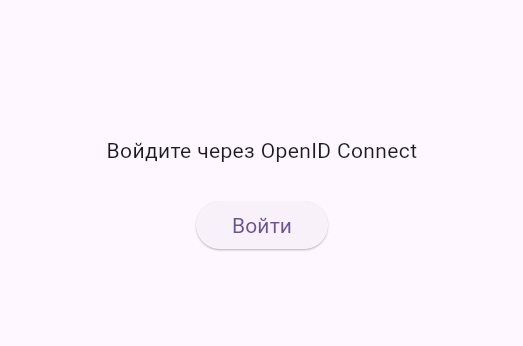
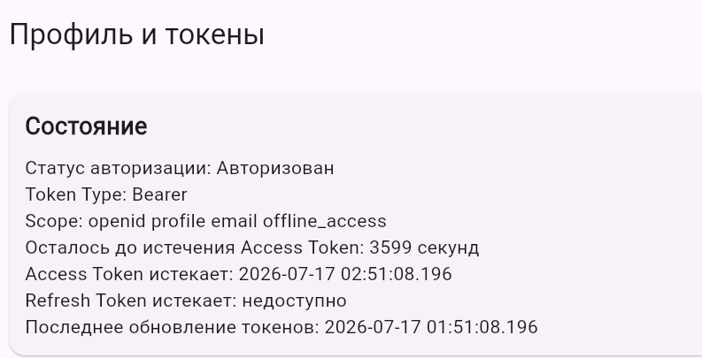
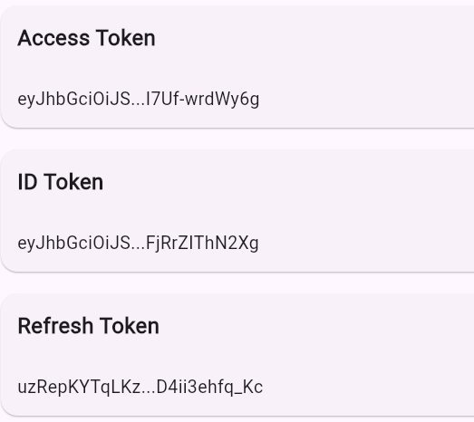
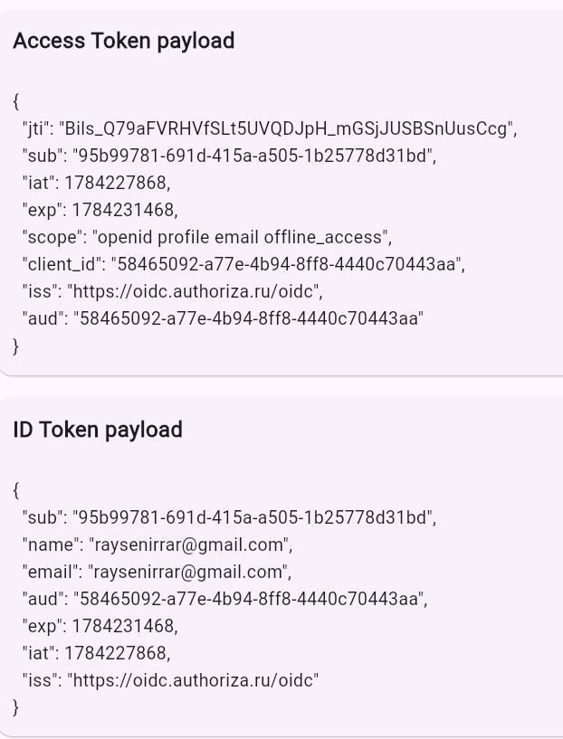
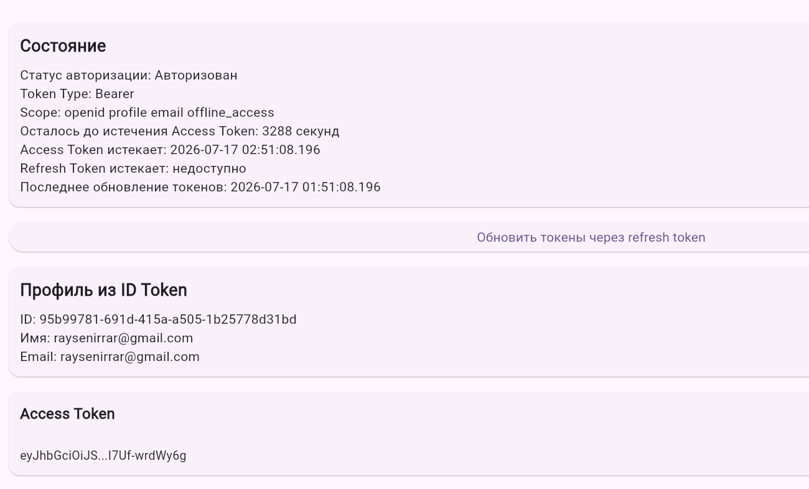
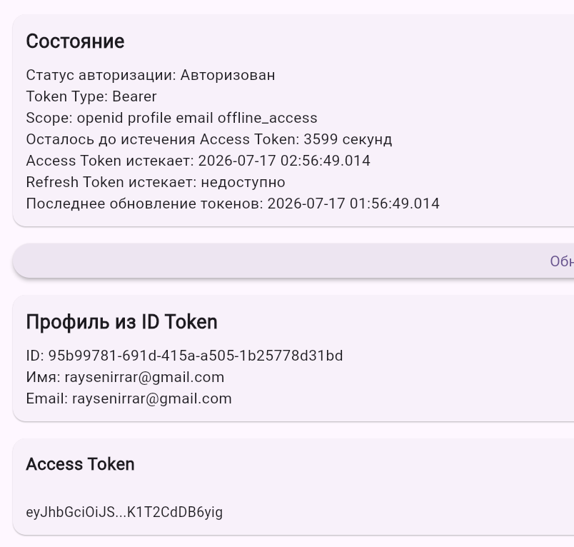

# Authoriza Flutter OIDC Client

**Демонстрационный проект интеграции Авторизы для Flutter**

Проект представляет собой Flutter-приложение, демонстрирующее интеграцию с сервисом Авториза по протоколу OpenID Connect.

Приложение реализует OpenID Connect Authorization Code Flow with PKCE, получение токенов через Token Endpoint, отображение полученных токенов, декодирование JWT payload, сохранение сессии, восстановление авторизации после перезапуска, ручное и автоматическое обновление токенов, а также выход с очисткой сохранённых данных.

## Назначение проекта

Данный проект является примером интеграции Авторизы для Flutter-приложения.

Он демонстрирует:

* реализацию OpenID Connect Authorization Code Flow with PKCE;
* использование Discovery Endpoint для получения OIDC-конфигурации;
* перенаправление пользователя в Авторизу после нажатия кнопки входа;
* получение Access Token, ID Token и Refresh Token через Token Endpoint;
* отображение ответа Token Endpoint;
* отображение decoded payload для Access Token и ID Token;
* сохранение токенов в локальное защищённое хранилище;
* восстановление сессии после перезапуска приложения;
* ручное обновление токенов через Refresh Token;
* автоматическое обновление Access Token до истечения срока действия;
* обработку ситуации, когда Refresh Token отсутствует, истёк или больше не принимается провайдером;
* выход из приложения с очисткой сохранённой сессии.

## Стек технологий

| Компонент | Инструмент |
| --- | --- |
| Язык | Dart |
| Фреймворк | Flutter |
| OIDC-клиент для Android/iOS | flutter_appauth |
| Web OIDC | Authorization Code Flow with PKCE |
| Хранение токенов | flutter_secure_storage |
| Управление состоянием | provider |
| HTTP-запросы для web-flow | http |
| Формирование PKCE code challenge для web | crypto |
| iOS CI build | Codemagic |

Используемые библиотеки:

```yaml
flutter_appauth
flutter_secure_storage
provider
http
crypto
```

Библиотека `flutter_appauth` используется для выполнения OpenID Connect Authorization Code Flow with PKCE на Android и iOS.

Для web-версии Authorization Code Flow with PKCE реализован в коде приложения: создаются `code_verifier`, `code_challenge`, `state`, выполняется redirect в Авторизу, после чего authorization code обменивается на токены через Token Endpoint.

## Требования к окружению

Перед запуском необходимо установить:

* Flutter SDK;
* Dart SDK;
* Android Studio или другой редактор;
* Android SDK;
* Chrome для запуска web-версии;
* физическое Android-устройство или Android Emulator;
* доступ к приложению, зарегистрированному в Авторизе.

Проверить Flutter можно командой:

```bash
flutter doctor
```

## Установка зависимостей

Для установки зависимостей необходимо выполнить:

```bash
flutter pub get
```

Если проект ранее собирался с ошибками или были изменены зависимости, можно выполнить очистку:

```bash
flutter clean
flutter pub get
```

## Настройка приложения в Авторизе

Для работы приложения необходимо создать OIDC-приложение в Авторизе и настроить параметры клиента.

### Основные параметры

| Параметр | Значение |
| --- | --- |
| Flow | Authorization Code Flow |
| PKCE | Включён |
| Тип клиента | Public client |
| Client authentication method | none |
| Mobile Redirect URI | `ru.authoriza.demo:/oauth2callback` |
| Web Redirect URI | `http://localhost:3000/` |

### Scopes

В приложении используются следующие scopes:

```text
openid
profile
email
offline_access
```

Scope `offline_access` используется для получения Refresh Token.

### Discovery

Приложение использует Discovery Endpoint.

OIDC endpoint-ы не прописываются вручную в коде. Приложение получает конфигурацию через Discovery.

Discovery URL:

```text
https://oidc.authoriza.ru/oidc/.well-known/openid-configuration
```

OIDC-конфигурация находится в файле:

```text
lib/config/oidc_config.dart
```

Пример конфигурации:

```dart
class OidcConfig {
  static const String discoveryUrl =
      'https://oidc.authoriza.ru/oidc/.well-known/openid-configuration';

  static const String clientId =
      '58465092-a77e-4b94-8ff8-4440c70443aa;

  static const String mobileRedirectUrl =
      'ru.authoriza.demo:/oauth2callback';

  static const String webRedirectUrl =
      'http://localhost:3000/';

  static const List<String> scopes = [
    'openid',
    'profile',
    'email',
    'offline_access',
  ];
}
```

`clientId` является идентификатором public client и может находиться в клиентском приложении.


## Redirect URI

### Android

Для Android используется custom scheme redirect:

```text
ru.authoriza.demo:/oauth2callback
```

В файле:

```text
android/app/src/main/AndroidManifest.xml
```

настроен intent-filter для обработки redirect URI.

### iOS

Для iOS redirect scheme добавлен в файл:

```text
ios/Runner/Info.plist
```

Используется схема:

```text
ru.authoriza.demo
```

iOS-сборка проверялась через Codemagic без code signing.

### Web

Для web-версии используется redirect URI:

```text
http://localhost:3000/
```

Поэтому web-версию необходимо запускать именно на порту `3000`.

## Запуск проекта

### Android

Запуск на Android-устройстве или эмуляторе:

```bash
flutter run
```

После запуска необходимо нажать кнопку входа. Приложение перенаправит пользователя в Авторизу, выполнит Authorization Code Flow with PKCE и после успешной авторизации отобразит полученные данные.

### Web

Запуск web-версии:

```bash
flutter run -d chrome --web-port 3000
```

После входа Авториза вернёт пользователя на:

```text
http://localhost:3000/
```

Приложение обработает authorization code и выполнит обмен кода на токены через Token Endpoint.

### iOS

iOS-сборка проверяется через Codemagic.

Файл конфигурации находится в корне проекта:

```text
codemagic.yaml
```

Workflow выполняет сборку iOS без подписи:

```bash
flutter build ios --debug --no-codesign
```

Такая сборка подтверждает, что проект компилируется под iOS.

Для установки приложения на реальный iPhone требуется Apple Developer signing и сборка подписанного `.ipa`. 

## Основные экраны приложения

### Экран входа

На экране входа отображается кнопка авторизации.

После нажатия кнопки приложение:

1. формирует Authorization Request;
2. использует Authorization Code Flow with PKCE;
3. перенаправляет пользователя в Авторизу;
4. получает authorization code;
5. обменивает authorization code на токены через Token Endpoint;
6. сохраняет полученные данные;
7. открывает экран профиля и токенов.

### Экран профиля и токенов

После успешной авторизации отображаются:

* статус авторизации;
* token_type;
* scope;
* время истечения Access Token;
* время истечения Refresh Token, если доступно;
* время последнего обновления токенов;
* данные пользователя из ID Token;
* маскированный Access Token;
* маскированный ID Token;
* маскированный Refresh Token;
* decoded payload Access Token;
* decoded payload ID Token.

Полные значения токенов на экран не выводятся. Токены отображаются в маскированном виде.

## Отображение содержимого токенов

Приложение декодирует JWT и отображает payload.

Для ID Token отображается:

```text
ID Token payload
```

Для Access Token отображается:

```text
Access Token payload
```

Декодирование выполняется локально на клиенте.

## Хранение данных аутентификации

Для хранения данных аутентификации используется `flutter_secure_storage`.

Сохраняются:

* Access Token;
* Refresh Token;
* ID Token;
* время истечения Access Token;
* token_type;
* scope;
* время последнего обновления токенов.

После закрытия и повторного запуска приложения выполняется попытка восстановления сессии.

Если Access Token ещё действителен, пользователь остаётся авторизованным.

Если Access Token истёк или скоро истечёт, приложение пытается обновить токены через Refresh Token.

Если Refresh Token отсутствует, истёк или Token Endpoint возвращает ошибку, сохранённые токены удаляются, состояние авторизации очищается, пользователь возвращается на экран входа.

## Обновление токенов

### Ручное обновление

На экране профиля доступна кнопка обновления токенов.

После нажатия приложение:

1. берёт сохранённый Refresh Token;
2. выполняет запрос к Token Endpoint;
3. получает новые токены;
4. обновляет сохранённые данные;
5. обновляет отображаемую информацию.

### Автоматическое обновление

Автоматическое обновление выполняется:

* при запуске приложения;
* по таймеру до истечения срока действия Access Token.

Access Token обновляется заранее, с запасом примерно 5 минут до истечения срока действия.

Если обновление прошло успешно, новые токены сохраняются, а интерфейс обновляется.

Если обновление завершилось ошибкой, приложение очищает сохранённые данные и возвращает пользователя на экран входа.

## Выход пользователя

При выходе приложение:

* удаляет сохранённые токены;
* удаляет сохранённые пользовательские данные;
* очищает состояние авторизации;
* очищает таймер автоматического обновления;
* возвращает пользователя на экран входа.

## Отображение состояния

Приложение отображает:

* статус авторизации;
* время истечения Access Token;
* время истечения Refresh Token, если доступно;
* время последнего обновления токенов.

Если Token Endpoint не возвращает время истечения Refresh Token, приложение отображает, что это значение недоступно.

## Проверка основных сценариев

### 1. Вход через Авторизу

1. Запустить приложение.
2. Нажать кнопку входа.
3. Выполнить авторизацию в Авторизе.
4. Убедиться, что после входа открыт экран профиля и токенов.

Ожидаемый результат:

* пользователь авторизован;
* получены Access Token, ID Token и Refresh Token;
* токены сохранены;
* токены отображаются в маскированном виде;
* JWT payload отображается.


### 2. Отображение токенов

После входа на экране должны отображаться:

* Access Token;
* ID Token;
* Refresh Token, если выдан;
* token_type;
* scope;
* срок действия Access Token;
* время последнего обновления токенов.

### 3. Отображение JWT payload

После входа на экране должны отображаться:

* Access Token payload;
* ID Token payload.

### 4. Ручное обновление токенов

1. Выполнить вход.
2. Нажать кнопку обновления токенов.
3. Проверить, что время последнего обновления изменилось.
4. Проверить, что данные на экране обновились.

Ожидаемый результат:

* Token Endpoint возвращает новые токены;
* новые токены сохраняются;
* интерфейс обновляется.

### 5. Автоматическое обновление Access Token

1. Выполнить вход.
2. Дождаться приближения срока истечения Access Token.
3. Приложение автоматически выполнит refresh заранее.

Ожидаемый результат:

* Access Token обновляется до истечения;
* сохранённые данные обновляются;
* пользователь остаётся авторизованным.

### 6. Восстановление сессии после перезапуска

1. Выполнить вход.
2. Закрыть приложение.
3. Запустить приложение снова.

Ожидаемый результат:

* приложение находит сохранённые токены;
* выполняет восстановление сессии;
* если Refresh Token ещё действителен, повторный вход не требуется.

### 7. Недействительный Refresh Token

Если Refresh Token отсутствует, истёк или отклонён Token Endpoint, приложение:

* удаляет сохранённые токены;
* очищает локальное состояние;
* не выполняет восстановление сессии;
* возвращает пользователя на экран входа.

### 8. Выход из приложения

1. Выполнить вход.
2. Нажать кнопку выхода.

Ожидаемый результат:

* сохранённые токены удаляются;
* пользовательские данные очищаются;
* интерфейс возвращается в состояние до авторизации;
* повторное восстановление сессии невозможно без нового входа.

## Скриншоты

### Экран до входа

Главная страница до авторизации.



### Экран после входа

Страница профиля после успешной авторизации.




### Отображение токенов

Блок профиля с маскированными токенами, сроками действия и JWT payload.





### До обновления токенов

До ручного обновления токенов.



### После обновления токенов

После ручного обновления токенов.



## Структура проекта

```text
flutter_application_1/
├── android/
├── ios/
├── lib/
│   ├── app/
│   │   ├── app.dart
│   │   └── auth_gate.dart
│   ├── auth/
│   │   ├── auth_provider.dart
│   │   ├── auth_service.dart
│   │   ├── auth_session_manager.dart
│   │   ├── token_storage.dart
│   │   ├── web_auth_service.dart
│   │   └── web_auth_service_stub.dart
│   ├── config/
│   │   └── oidc_config.dart
│   ├── models/
│   │   ├── auth_state.dart
│   │   ├── auth_tokens.dart
│   │   └── user_profile.dart
│   ├── screens/
│   │   ├── home_screen.dart
│   │   └── login_screen.dart
│   ├── utils/
│   │   ├── date_time_utils.dart
│   │   ├── jwt_utils.dart
│   │   └── token_masker.dart
│   ├── widgets/
│   │   ├── jwt_payload_block.dart
│   │   ├── masked_token_block.dart
│   │   ├── profile_block.dart
│   │   └── status_block.dart
│   └── main.dart
├── web/
├── codemagic.yaml
├── pubspec.yaml
└── README.md
```

## Возможные проблемы и решения

| Проблема | Возможная причина | Решение |
| --- | --- | --- |
| `INSTALL_FAILED_UPDATE_INCOMPATIBLE` при установке на Android | На устройстве уже установлена версия приложения с другой подписью | Удалить старое приложение с телефона или выполнить `adb uninstall com.example.flutter_application_1` |
| После входа приложение не открывается обратно на Android | Не настроен custom scheme redirect или intent-filter | Проверить redirect URI `ru.authoriza.demo:/oauth2callback` в Авторизе и intent-filter в `AndroidManifest.xml` |
| Ошибка `You need to use a Theme.AppCompat theme` у `RedirectUriReceiverActivity` | Для activity обработки redirect не задана совместимая тема | Добавить `AppAuthRedirectTheme` в `styles.xml` и подключить `androidx.appcompat:appcompat` |
| Ошибка `Couldn't resolve the package ` | В `pubspec.yaml` нет нужной зависимости | Добавить, затем выполнить `flutter pub get` |
| Web-версия не возвращается в приложение после входа | Приложение запущено не на том порту или redirect URI не совпадает | Запускать web через `flutter run -d chrome --web-port 3000` и проверить redirect URI `http://localhost:3000/` |
| Не приходит Refresh Token | Не указан scope `offline_access` или провайдер не выдал refresh token | Проверить scopes в `OidcConfig`|
| После перезапуска пользователь не восстановился | Refresh Token истёк, был очищен или отклонён Token Endpoint | Выполнить вход заново; приложение очищает повреждённую или недействительную сессию |
| При refresh пользователь возвращается на экран входа | Refresh Token стал недействительным, истёк или был отозван | Это ожидаемое поведение: приложение удаляет токены и просит войти заново |
| `Runner.app` из Codemagic не устанавливается на iPhone | Сборка выполнена без code signing | Для реальной установки нужен Apple Developer signing и сборка подписанного `.ipa` |

## Полезные ссылки

* [OpenID Connect Core 1.0](https://openid.net/specs/openid-connect-core-1_0.html)
* [OAuth 2.0 Authorization Code Flow with PKCE](https://datatracker.ietf.org/doc/html/rfc7636)
* [flutter_appauth на pub.dev](https://pub.dev/packages/flutter_appauth)
* [flutter_secure_storage на pub.dev](https://pub.dev/packages/flutter_secure_storage)
* [provider на pub.dev](https://pub.dev/packages/provider)
* [Flutter: установка и настройка](https://docs.flutter.dev/get-started/install)
* [Flutter: запуск web-приложений](https://docs.flutter.dev/platform-integration/web/building)
* [AppAuth for Android](https://github.com/openid/AppAuth-Android)
* [AppAuth for iOS](https://github.com/openid/AppAuth-iOS)
* [Codemagic: Flutter apps](https://docs.codemagic.io/flutter-configuration/flutter-projects/)
* [Codemagic: iOS code signing](https://docs.codemagic.io/flutter-code-signing/ios-code-signing/)
